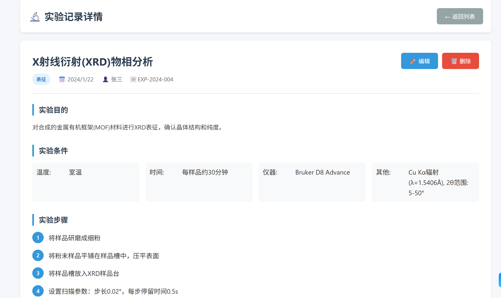
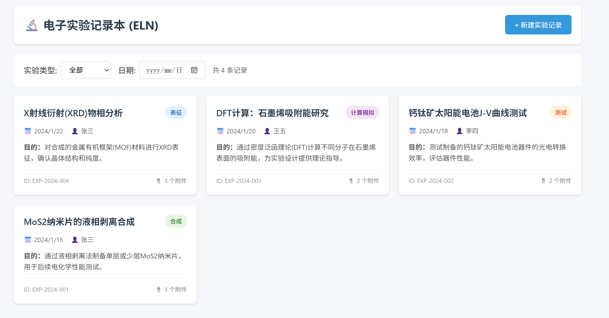

# 电子实验记录本 (ELN) - 原型

> **⚠️ 这是一个原型（Prototype）应用，并非生产环境就绪的产品。**

## 功能概述

这是一个用于科研实验记录的Web原型应用，主要面向化学、材料、物理等实验室场景。

### 核心功能

| 功能 | 说明 |
|------|------|
| 实验记录管理 | 新建、查看、编辑、删除实验记录 |
| 结构化记录 | 实验目的、条件、步骤、结果、结论、备注 |
| 实验类型支持 | 合成、表征、测试、计算模拟、其他 |
| 附件管理 | 支持关联多个附件文件名 |
| 筛选检索 | 按实验类型、日期筛选记录 |
| 数据持久化 | 使用浏览器localStorage本地存储 |

## 如何使用

首先，克隆仓库到本地：

```bash
git clone <仓库地址>
cd eln-prototype
```

### 方法一：直接打开
1. 双击 `index.html` 文件，在浏览器中打开即可使用

### 方法二：本地服务器（推荐）
```bash
# 使用Python启动本地服务器
python -m http.server 8000

# 或使用Node.js
npx http-server

# 然后访问: http://localhost:8000
```

### 方法三：AI IDE / Claude Code CLI（自动化）
将仓库地址提供给 AI IDE（如 Cursor、Windsurf）或 Claude Code CLI，即可自动完成环境配置和开发任务。

## 页面说明

### 1. 实验列表页

- 显示所有实验记录的卡片视图
- 可按类型和日期筛选
- 点击卡片查看详情
- 点击"新建实验记录"创建新记录

### 2. 新建/编辑实验页
- **基本信息**: 标题、日期、实验者、类型
- **实验目的**: 文本描述
- **实验条件**: 温度、时间、溶剂、仪器、其他
- **实验步骤**: 动态添加多个步骤
- **实验结果**: 文本 + 关键数值
- **实验结论**: 总结与分析
- **备注**: 补充说明
- **附件**: 关联文件名列表

### 3. 实验详情页

- 完整展示实验所有信息
- 支持编辑和删除操作
- 显示创建和更新时间

## 技术说明

- **纯前端实现**: HTML + CSS + JavaScript，无需后端
- **数据存储**: 浏览器 localStorage（注意：清空浏览器数据会丢失记录）
- **兼容性**: 支持现代浏览器（Chrome, Firefox, Safari, Edge）

## 数据结构

```javascript
{
  id: string,           // 唯一标识 (如: EXP-2024-001)
  title: string,        // 实验标题
  date: string,         // 实验日期 (YYYY-MM-DD)
  experimenter: string, // 实验者
  type: string,         // 实验类型: synthesis/characterization/testing/simulation/other
  purpose: string,      // 实验目的
  conditions: {         // 实验条件（结构化）
    temperature: string,
    time: string,
    solvent: string,
    instrument: string,
    other: string
  },
  steps: string[],      // 实验步骤数组
  results: string,      // 实验结果
  conclusion: string,   // 实验结论
  notes: string,        // 备注
  attachments: string[] // 附件文件名列表
}
```

## 局限性（原型说明）

此原型应用有以下限制，在实际产品化时需要解决：

1. **无用户系统**: 没有登录、权限管理、多用户协作
2. **无实际文件上传**: 仅记录文件名，不存储文件内容
3. **本地存储**: 数据存储在浏览器中，清除缓存会丢失，不支持跨设备同步
4. **无数据导入导出**: 不支持批量导入或导出实验记录
5. **无搜索功能**: 只能筛选，不支持全文搜索
6. **无版本控制**: 修改记录时无法追溯历史版本

## 后续扩展方向

如需将此原型发展为智能 ELN，建议接入 LLM 实现以下功能：

- **AI 实验助手**: 自然语言交互，辅助填写实验记录
- **智能总结**: 自动生成实验结论和结果摘要
- **实验建议**: 基于历史数据推荐实验参数和改进方向
- **异常检测**: 分析实验结果，识别潜在问题或异常数据
- **文献检索**: 自动关联相关文献和参考资料
- **语音输入**: 支持语音转文字快速记录实验过程

---

**原型版本**: v0.1.0
**创建日期**: 2024
